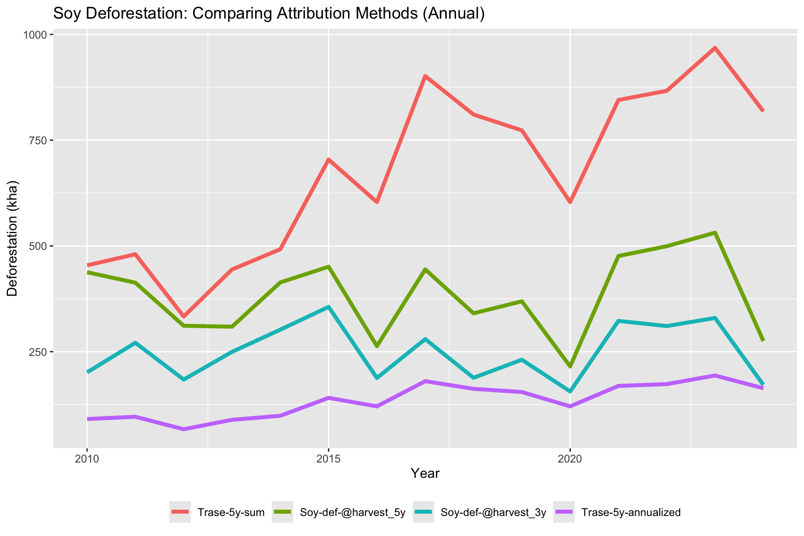
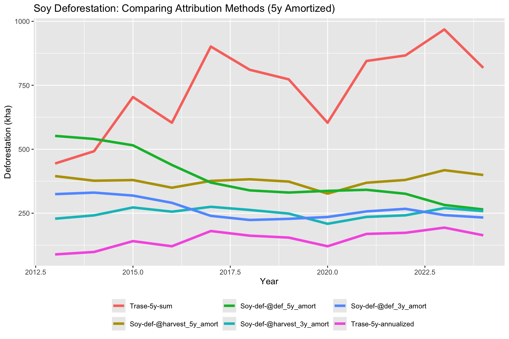
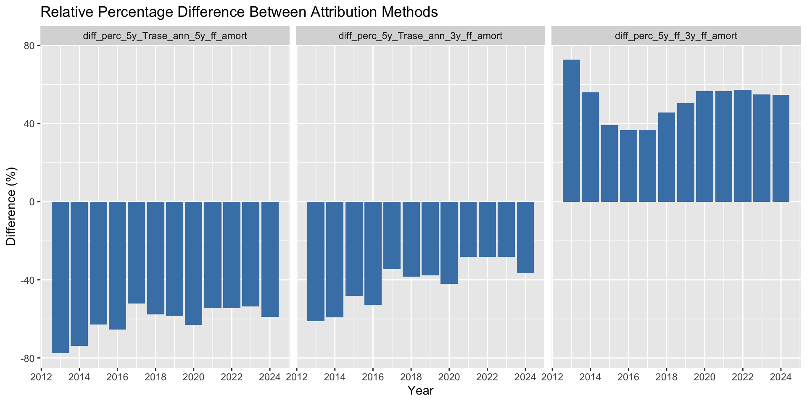
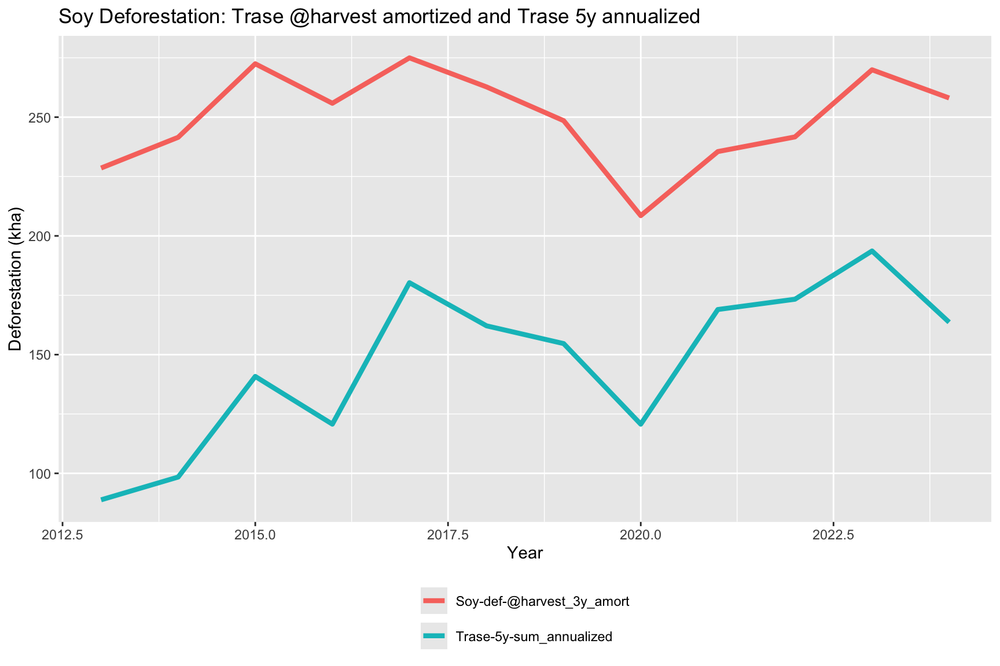
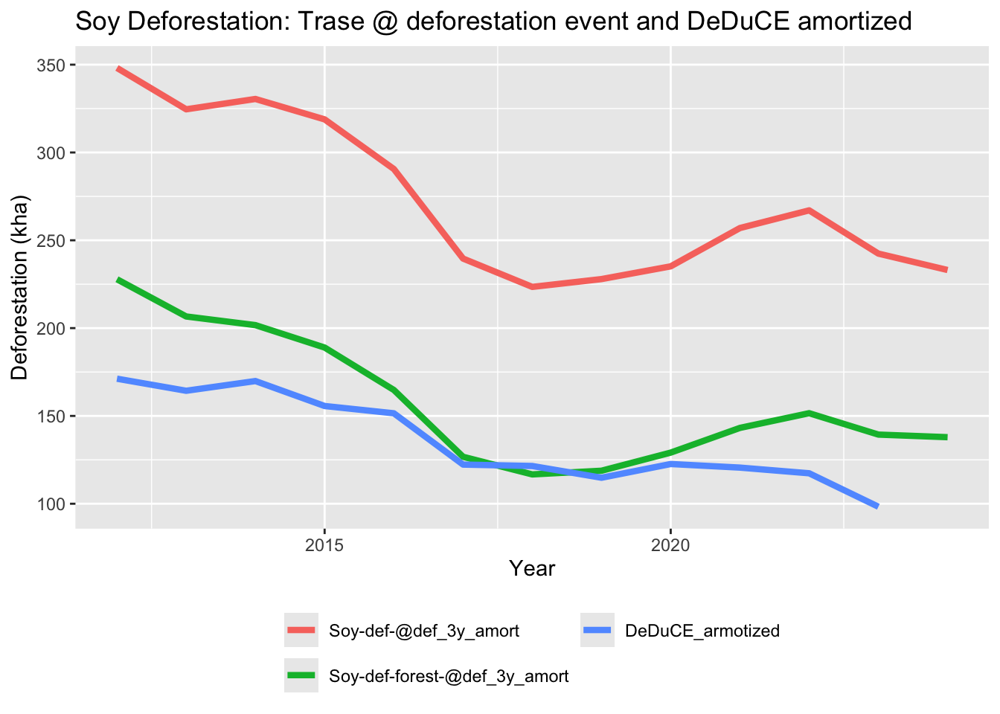
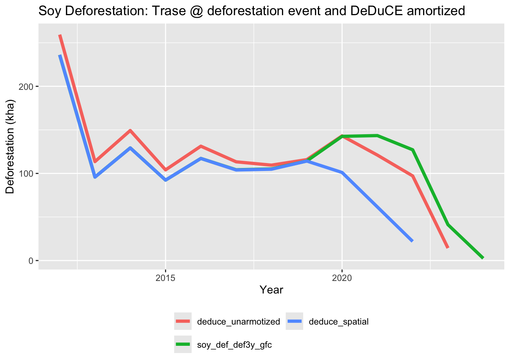
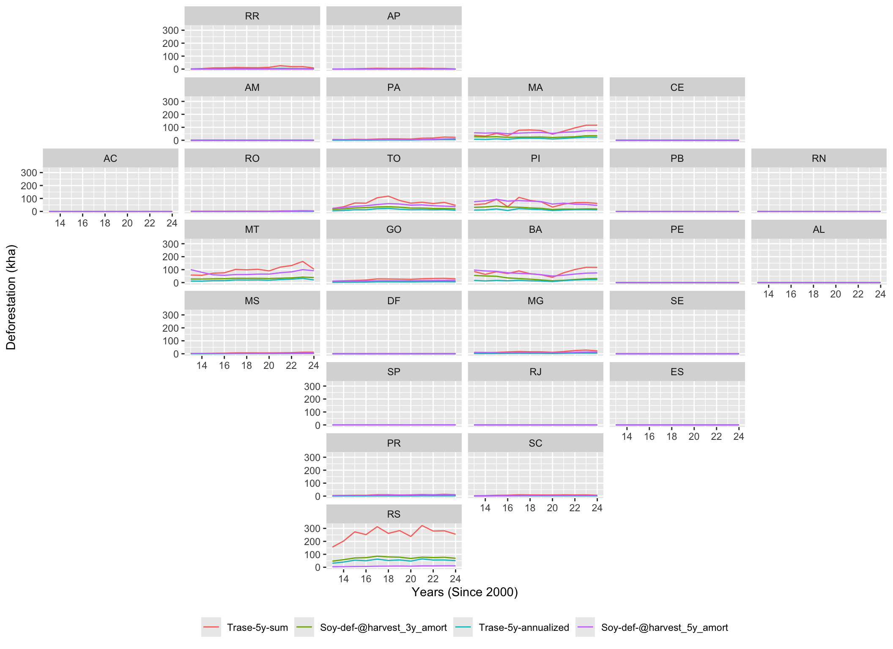
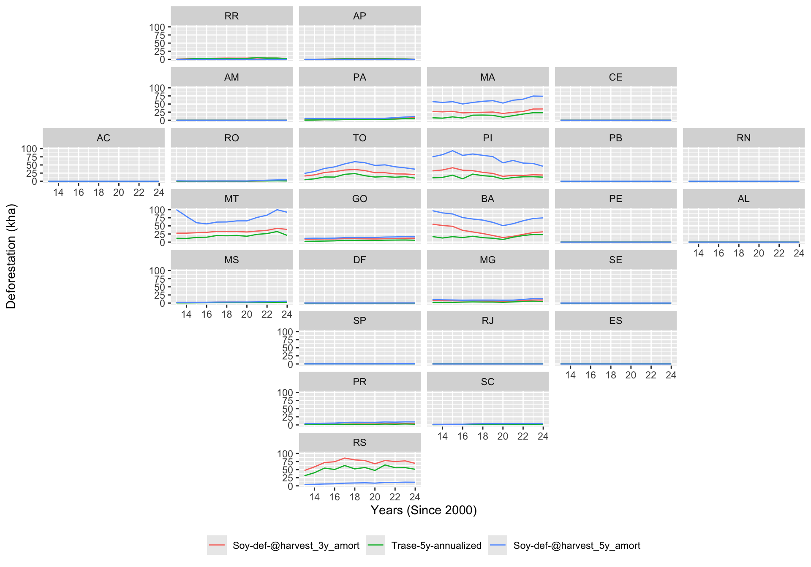
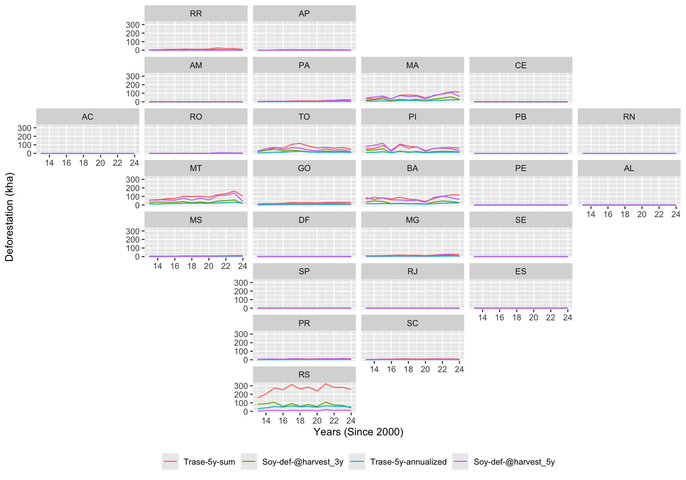
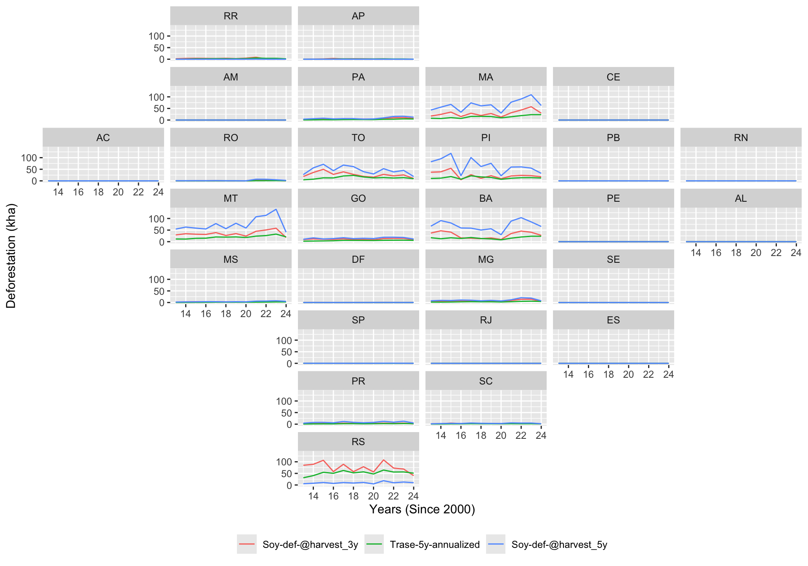

# Problem definition

Trase subnational data reports commodity deforestation as the summed deforestation over a specific time period that occurred on the land used for commodity production. This is different from DeDuCE, classifying assigning each deforestation event to a specific commodity. 

DeDuCE approach is partly considered superior, because it is true to the annually observed deforestation (no double counting), allowing single and multi year reporting of commodity deforestation (multi year is not supported by Trase CDO sums, because one deforestation event would be counted multiple times.)

DeDuCE reports deforestation at the deforestation event, which may be unsuitable for Trase CDO, aiming to report the deforestation embedded in the harvest. 
However, DeDuCE metrics can easily be shifted to the harvest year instead of deforestation year, enabling reporting embedded deforestation.

## Suggested solution detailed below
Add additional metric following DeDuCE deforestation classification approach and report commodity deforestation
- At deforestation event year (note, recent years will undercount deforestation)
- At harvest year (note, by moving to harvest year, we can report the most recent year)


# Exploring the new deforestation metrics
This document compares Trase commodity deforestation attribution methods, with DeDuCE forward looking approach, and compares results to original DeDuCE results. 

Aim is to suggest a more comparable metric for Trase to adopt in its context impacts reporting, comparable to DeDuCE and annual deforestation reporting. 

## Setup and data ingestion

In this section, we load the required libraries for spatial analysis, data manipulation, and visualization, and import our annual soy metrics datasets.


::: {.cell}

```{.r .cell-code}
library(tidyverse)
library(slider)
library(arrow)
library(geofacet)
library(scales)
library(sf)
library(zoo)

# Load datasets
soy_br <- read_parquet(
  "~/documents/data/annual_metrics/soy_annual_br_v3.parquet"
)
soy_states <- read_parquet(
  "~/documents/data/annual_metrics/soy_annual_br_states_v3.parquet"
)
soy_supply_chain_2022_v2 <- read_parquet(
  "~/documents/data/annual_metrics/soy_2022_post_embedding_quants_v3.parquet"
)
```
:::


# Country-level analysis
I begin by evaluating how different methodological choices impact estimated soy-driven deforestation at the national level. Specifically, I compare:

- 5-year Sum: Cumulative backward-looking deforestation.
- 5-year Annualized: Backward-looking annualized deforestation.
- 5-year / 3-year Harvest Attribution: Forward-looking spatial attribution windows.

## Annual attribution comparison

::: {.cell}

```{.r .cell-code}
ggplot(
  soy_br |>
    filter(year >= 2010 & year <= 2024) |>
    filter(
      variable %in%
        c(
          "soy_def_5y_back",
          "soy_def_5y_annualized_back",
          "soy_def_harvest5y",
          "soy_def_harvest3y"
        )
    ) |>
    mutate(
      variable = case_when(
        variable == "soy_def_5y_back" ~ "Trase-5y-sum",
        variable == "soy_def_5y_annualized_back" ~ "Trase-5y-annualized",
        variable == "soy_def_harvest5y" ~ "Soy-def-@harvest_5y",
        variable == "soy_def_harvest3y" ~ "Soy-def-@harvest_3y",
        .default = variable
      )
    ),
  aes(year, ha / 1000, color = fct_reorder(variable, ha, .desc = TRUE))
) +
  geom_line(lwd = 1.5) +
  labs(
    title = "Soy Deforestation: Comparing Attribution Methods (Annual)",
    y = "Deforestation (kha)",
    x = "Year",
    color = NULL
  ) +

  theme(legend.position = "bottom")
```

::: {.cell-output-display}
{width=864}
:::
:::


::: {.cell}

```{.r .cell-code}
soy_br |>
  filter(year >= 2014 & year <= 2024) |>
  filter(
    variable %in%
      c(
        "soy_def_5y_back",
        "soy_def_5y_annualized_back",
        "soy_def_harvest5y",
        "soy_def_harvest3y"
      )
  ) |>
  filter(year >= 2014) |>
  mutate(kha = round(ha / 1000, 2)) |>
  select(-ha) |>
  pivot_wider(year, names_from = variable, values_from = kha) |>
  mutate(
    fraction_3y = soy_def_harvest3y /
      soy_def_5y_back,
    fraction_5y = soy_def_harvest5y /
      soy_def_5y_back,
  ) |>
  knitr::kable(format = "html")
```

::: {.cell-output-display}
`````{=html}
<table>
 <thead>
  <tr>
   <th style="text-align:right;"> year </th>
   <th style="text-align:right;"> soy_def_5y_annualized_back </th>
   <th style="text-align:right;"> soy_def_5y_back </th>
   <th style="text-align:right;"> soy_def_harvest3y </th>
   <th style="text-align:right;"> soy_def_harvest5y </th>
   <th style="text-align:right;"> fraction_3y </th>
   <th style="text-align:right;"> fraction_5y </th>
  </tr>
 </thead>
<tbody>
  <tr>
   <td style="text-align:right;"> 2014 </td>
   <td style="text-align:right;"> 98.45 </td>
   <td style="text-align:right;"> 492.23 </td>
   <td style="text-align:right;"> 302.03 </td>
   <td style="text-align:right;"> 413.66 </td>
   <td style="text-align:right;"> 0.6135953 </td>
   <td style="text-align:right;"> 0.8403795 </td>
  </tr>
  <tr>
   <td style="text-align:right;"> 2015 </td>
   <td style="text-align:right;"> 140.82 </td>
   <td style="text-align:right;"> 704.09 </td>
   <td style="text-align:right;"> 355.83 </td>
   <td style="text-align:right;"> 450.84 </td>
   <td style="text-align:right;"> 0.5053757 </td>
   <td style="text-align:right;"> 0.6403159 </td>
  </tr>
  <tr>
   <td style="text-align:right;"> 2016 </td>
   <td style="text-align:right;"> 120.72 </td>
   <td style="text-align:right;"> 603.61 </td>
   <td style="text-align:right;"> 187.88 </td>
   <td style="text-align:right;"> 263.21 </td>
   <td style="text-align:right;"> 0.3112606 </td>
   <td style="text-align:right;"> 0.4360597 </td>
  </tr>
  <tr>
   <td style="text-align:right;"> 2017 </td>
   <td style="text-align:right;"> 180.29 </td>
   <td style="text-align:right;"> 901.44 </td>
   <td style="text-align:right;"> 279.68 </td>
   <td style="text-align:right;"> 444.44 </td>
   <td style="text-align:right;"> 0.3102591 </td>
   <td style="text-align:right;"> 0.4930334 </td>
  </tr>
  <tr>
   <td style="text-align:right;"> 2018 </td>
   <td style="text-align:right;"> 162.13 </td>
   <td style="text-align:right;"> 810.63 </td>
   <td style="text-align:right;"> 188.28 </td>
   <td style="text-align:right;"> 340.66 </td>
   <td style="text-align:right;"> 0.2322638 </td>
   <td style="text-align:right;"> 0.4202410 </td>
  </tr>
  <tr>
   <td style="text-align:right;"> 2019 </td>
   <td style="text-align:right;"> 154.65 </td>
   <td style="text-align:right;"> 773.25 </td>
   <td style="text-align:right;"> 230.95 </td>
   <td style="text-align:right;"> 369.04 </td>
   <td style="text-align:right;"> 0.2986744 </td>
   <td style="text-align:right;"> 0.4772583 </td>
  </tr>
  <tr>
   <td style="text-align:right;"> 2020 </td>
   <td style="text-align:right;"> 120.72 </td>
   <td style="text-align:right;"> 603.58 </td>
   <td style="text-align:right;"> 155.86 </td>
   <td style="text-align:right;"> 215.15 </td>
   <td style="text-align:right;"> 0.2582259 </td>
   <td style="text-align:right;"> 0.3564565 </td>
  </tr>
  <tr>
   <td style="text-align:right;"> 2021 </td>
   <td style="text-align:right;"> 169.00 </td>
   <td style="text-align:right;"> 844.99 </td>
   <td style="text-align:right;"> 322.78 </td>
   <td style="text-align:right;"> 476.06 </td>
   <td style="text-align:right;"> 0.3819927 </td>
   <td style="text-align:right;"> 0.5633913 </td>
  </tr>
  <tr>
   <td style="text-align:right;"> 2022 </td>
   <td style="text-align:right;"> 173.33 </td>
   <td style="text-align:right;"> 866.66 </td>
   <td style="text-align:right;"> 310.54 </td>
   <td style="text-align:right;"> 499.31 </td>
   <td style="text-align:right;"> 0.3583181 </td>
   <td style="text-align:right;"> 0.5761314 </td>
  </tr>
  <tr>
   <td style="text-align:right;"> 2023 </td>
   <td style="text-align:right;"> 193.65 </td>
   <td style="text-align:right;"> 968.25 </td>
   <td style="text-align:right;"> 329.65 </td>
   <td style="text-align:right;"> 531.30 </td>
   <td style="text-align:right;"> 0.3404596 </td>
   <td style="text-align:right;"> 0.5487219 </td>
  </tr>
  <tr>
   <td style="text-align:right;"> 2024 </td>
   <td style="text-align:right;"> 163.63 </td>
   <td style="text-align:right;"> 818.15 </td>
   <td style="text-align:right;"> 171.53 </td>
   <td style="text-align:right;"> 275.26 </td>
   <td style="text-align:right;"> 0.2096559 </td>
   <td style="text-align:right;"> 0.3364420 </td>
  </tr>
</tbody>
</table>

`````
:::
:::


## Key insights:

- 5-year Sum inherently double-counts annual deforestation over the evaluation window.
- 5-year Annualized undercounts actual annual deforestation. This occurs because the conversion from cleared land to soy commonly does not happen in the immediate first year after deforestation; dividing uniformly by 5 dilutes the calculated impact.
- 3-year vs. 5-year forward attribution windows yields highly similar trends, though the 5-year window remains expectedly higher.

## Amortized 5-year estimation
To smooth out annual volatility, I calculate a 5-year right-aligned rolling mean (amortization) for the forward-looking harvest attribution variables.


::: {.cell}

```{.r .cell-code}
# soy_br_5ymean <- soy_br |>
#   filter(variable %in% c("soy_def_harvest5y", "soy_def_harvest3y")) |>
#   ungroup() |>
#   group_by(variable) |>
#   arrange(year, .by_group = TRUE) |>
#   mutate(amortized_5 = rollmean(ha, k = 5, align = "right", fill = NA)) |>
#   transmute(
#     year = year,
#     variable = paste0(variable, "_5y_amort"),
#     ha = amortized_5
#   )

# soy_br_amort <- soy_br |> bind_rows(soy_br_5ymean)
```
:::


::: {.cell}

```{.r .cell-code}
ggplot(
  soy_br |>
    filter(year >= 2013 & year <= 2024) |>
    filter(
      variable %in%
        c(
          "soy_def_5y_back",
          "soy_def_5y_annualized_back",
          "soy_def_harvest5y_5y_amortized",
          "soy_def_harvest3y_5y_amortized",
          "soy_def_def5y_5y_amortized",
          "soy_def_def3y_5y_amortized"
        )
    ) |>
    mutate(
      variable = case_when(
        variable == "soy_def_5y_back" ~ "Trase-5y-sum",
        variable == "soy_def_5y_annualized_back" ~ "Trase-5y-annualized",
        variable ==
          "soy_def_harvest5y_5y_amortized" ~ "Soy-def-@harvest_5y_amort",
        variable ==
          "soy_def_harvest3y_5y_amortized" ~ "Soy-def-@harvest_3y_amort",
        variable == "soy_def_def5y_5y_amortized" ~ "Soy-def-@def_5y_amort",
        variable == "soy_def_def3y_5y_amortized" ~ "Soy-def-@def_3y_amort",
        .default = variable
      )
    ),
  aes(year, ha / 1000, color = fct_reorder(variable, ha, .desc = TRUE))
) +
  geom_line(lwd = 1.5) +
  labs(
    title = "Soy Deforestation: Comparing Attribution Methods (5y Amortized)",
    y = "Deforestation (kha)",
    x = "Year",
    color = NULL
  ) +

  theme(legend.position = "bottom") +
  guides(color = guide_legend(nrow = 2))
```

::: {.cell-output-display}
{width=864}
:::
:::


## Key insights:

- amortization smoothes the reported deforestation estimates. Decision if annual or amortized metrics are better to show needed.
- from data perspective, amortization might provide more consistent and robust reporting
  - does not pick up changing trends as quick, but also more robust to data issues
  - from a user understanding a more simple annual metric.


relevant context information:
- Deduce dashboard reports annual deforestation
- Trase factsheets use 5 year amortized DeDuCE deforestation


## Percentage differences between methods
To quantify the divergence between backward-looking and forward-looking metrics, I also look at the relative percentage differences.

::: {.cell}

```{.r .cell-code}
soy_br_amort_wide <- soy_br |>
  pivot_wider(id_cols = year, names_from = variable, values_from = ha)

soy_br_amort_perc <- soy_br_amort_wide |>
  filter(year >= 2013) |>
  transmute(
    year = year,
    diff_perc_5y_Trase_ann_5y_ff_amort = ((soy_def_5y_annualized_back -
      soy_def_harvest5y_5y_amortized) /
      soy_def_harvest5y_5y_amortized) *
      100,
    diff_perc_5y_Trase_ann_3y_ff_amort = ((soy_def_5y_annualized_back -
      soy_def_harvest3y_5y_amortized) /
      soy_def_harvest3y_5y_amortized) *
      100,
    diff_perc_5y_ff_3y_ff_amort = ((soy_def_harvest5y_5y_amortized -
      soy_def_harvest3y_5y_amortized) /
      soy_def_harvest3y_5y_amortized) *
      100
  )

soy_br_amort_perc_l <- soy_br_amort_perc |>
  pivot_longer(cols = -year, names_to = "variable", values_to = "percent")

ggplot(soy_br_amort_perc_l, aes(year, percent)) +
  geom_bar(stat = "identity", fill = "steelblue") +
  facet_wrap(~ fct_reorder(variable, percent)) +
  labs(
    title = "Relative Percentage Difference Between Attribution Methods",
    x = "Year",
    y = "Difference (%)"
  ) +
  scale_x_continuous(breaks = breaks_pretty())
```

::: {.cell-output-display}
{width=960}
:::
:::


## Key insights:

- Annualization of the Trase 5-year sum would miss between 20% and 80% of soy deforestation annually, depending heavily on the reference year and whether a 3- or 5-year attribution window is chosen.
- A 5-year forward-looking window maps roughly 22% to 30% more soy deforestation than a 3-year forward-looking window.

# Forward looking attribution vs deduce
As the intention is to align methods between Trase subnational context and DeDuCE, it is important to understand the difference between attribution to deforestation vs harvest year


::: {.cell}

```{.r .cell-code}
ggplot(
  soy_br |>
    filter(year >= 2013 & year <= 2024) |>
    filter(
      variable %in%
        c(
          #"soy_def_5y_back",
          #"soy_def_harvest5y",
          "soy_def_5y_annualized_back",
          "soy_def_harvest3y_5y_amortized" #,
          #"soy_def_def3y_5y_amortized",
          #"deduce_unarmotized_5y_amortized" #,
          #"soy_def_def3y_gfc_5y_amortized"
        )
    ) |>
    mutate(
      variable = case_when(
        variable == "soy_def_5y_back" ~ "Trase-5y-sum",
        #variable == "soy_def_harvest5y" ~ "Soy-def-@harvest_5y",
        variable == "soy_def_5y_annualized_back" ~ "Trase-5y-sum_annualized",
        variable ==
          "soy_def_harvest3y_5y_amortized" ~ "Soy-def-@harvest_3y_amort",
        variable == "soy_def_def3y_5y_amortized" ~ "Soy-def-@def_3y_amort",
        variable == "deduce_unarmotized_5y_amortized" ~ "DeDuCE_armotized",
        variable == "soy_def_def3y_gfc_5y_amortized" ~ "DeDuCE_spatial_amort",
        .default = variable
      )
    ),
  aes(year, ha / 1000, color = fct_reorder(variable, ha, .desc = TRUE))
) +
  geom_line(lwd = 1.5) +
  labs(
    title = "Soy Deforestation: Trase @harvest amortized and Trase 5y annualized",
    y = "Deforestation (kha)",
    x = "Year",
    color = NULL
  ) +
  theme(legend.position = "bottom") +
  guides(color = guide_legend(nrow = 2))
```

::: {.cell-output-display}
{width=864}
:::
:::


::: {.cell}

```{.r .cell-code}
ggplot(
  soy_br |>
    filter(year >= 2012 & year <= 2024) |>
    filter(
      variable %in%
        c(
          #"soy_def_5y_back",
          #"soy_def_harvest5y",
          #"soy_def_harvest3y_5y_amortized",
          "soy_def_def3y_forest_5y_amortized",
          "soy_def_def3y_5y_amortized",
          "deduce_unarmotized_5y_amortized" #,
          #"soy_def_def3y_gfc_5y_amortized"
        )
    ) |>
    mutate(
      variable = case_when(
        #variable == "soy_def_5y_back" ~ "Trase-5y-sum",
        #variable == "soy_def_harvest5y" ~ "Soy-def-@harvest_5y",
        variable ==
          "soy_def_harvest3y_5y_amortized" ~ "Soy-def-@harvest_3y_amort",
        variable == "soy_def_def3y_5y_amortized" ~ "Soy-def-@def_3y_amort",
        variable == "soy_def_def3y_forest_5y_amortized" ~
          "Soy-def-forest-@def_3y_amort",
        variable == "deduce_unarmotized_5y_amortized" ~ "DeDuCE_armotized",
        variable == "soy_def_def3y_gfc_5y_amortized" ~ "DeDuCE_spatial_amort",
        .default = variable
      )
    ),
  aes(year, ha / 1000, color = fct_reorder(variable, ha, .desc = TRUE))
) +
  geom_line(lwd = 1.5) +
  labs(
    title = "Soy Deforestation: Trase @ deforestation event and DeDuCE amortized",
    y = "Deforestation (kha)",
    x = "Year",
    color = NULL
  ) +
  theme(legend.position = "bottom") +
  guides(color = guide_legend(nrow = 2))
```

::: {.cell-output-display}
{width=672}
:::
:::


::: {.cell}

```{.r .cell-code}
ggplot(
  soy_br |>
    filter(year >= 2012 & year <= 2024) |>
    filter(
      variable %in%
        c(
          #"soy_def_5y_back",
          #"soy_def_harvest5y",
          #"soy_def_harvest3y_5y_amortized",
          #"soy_def_def3y_5y_amortized",
          "deduce_unarmotized",
          "deduce_spatial",
          "soy_def_def3y_gfc"
        )
    ) |>
    mutate(
      variable = case_when(
        #variable == "soy_def_5y_back" ~ "Trase-5y-sum",
        #variable == "soy_def_harvest5y" ~ "Soy-def-@harvest_5y",
        variable ==
          "soy_def_harvest3y_5y_amortized" ~ "Soy-def-@harvest_3y_amort",
        variable == "soy_def_def3y_5y_amortized" ~ "Soy-def-@def_3y_amort",
        variable == "deduce_unarmotized_5y_amortized" ~ "DeDuCE_armotized",
        variable == "soy_def_def3y_gfc_5y_amortized" ~ "DeDuCE_spatial_amort",
        .default = variable
      )
    ),
  aes(year, ha / 1000, color = fct_reorder(variable, ha, .desc = TRUE))
) +
  geom_line(lwd = 1.5) +
  labs(
    title = "Soy Deforestation: Trase @ deforestation event and DeDuCE amortized",
    y = "Deforestation (kha)",
    x = "Year",
    color = NULL
  ) +
  theme(legend.position = "bottom") +
  guides(color = guide_legend(nrow = 2))
```

::: {.cell-output-display}
{width=672}
:::
:::

## key difference
- difference of trends due to different attribution year DeDuCE attributes to deforestation, while Trase commonly aims to attribute to harvest. 
- overall difference in total amount are due to differences in forest definition and data deforestation data used


# State-Level Analysis
I now scale the calculations down to individual Brazilian states to determine if sub-national trends and patterns align with national averages.

::: {.cell}

```{.r .cell-code}
# soy_states_5ymean <- soy_states |>
#   filter(variable %in% c("soy_def_harvest5y", "soy_def_harvest3y")) |>
#   ungroup() |>
#   group_by(variable, code, name, abbreviation) |>
#   arrange(year, .by_group = TRUE) |>
#   mutate(amortized_5 = rollmean(ha, k = 5, align = "right", fill = NA)) |>
#   transmute(
#     year = year,
#     code = code,
#     name = name,
#     abbreviation = abbreviation,
#     variable = paste0(variable, "_5y_amort"),
#     ha = amortized_5
#   )

# soy_states_amort <- soy_states |> bind_rows(soy_states_5ymean)
```
:::


## State-level: Amortized

::: {.cell}

```{.r .cell-code}
ggplot(
  soy_states |>
    filter(year >= 2013) |>
    filter(
      variable %in%
        c(
          "soy_def_5y_back",
          "soy_def_5y_annualized_back",
          "soy_def_harvest5y_5y_amortized",
          "soy_def_harvest3y_5y_amortized"
        )
    ) |>
    mutate(
      variable = case_when(
        variable == "soy_def_5y_back" ~ "Trase-5y-sum",
        variable == "soy_def_5y_annualized_back" ~ "Trase-5y-annualized",
        variable ==
          "soy_def_harvest5y_5y_amortized" ~ "Soy-def-@harvest_5y_amort",
        variable ==
          "soy_def_harvest3y_5y_amortized" ~ "Soy-def-@harvest_3y_amort",
        .default = variable
      )
    ),
  aes(year - 2000, ha / 1000, color = fct_reorder(variable, ha, .desc = TRUE))
) +
  geom_line() +
  scale_x_continuous(breaks = breaks_pretty()) +
  labs(x = "Years (Since 2000)", y = "Deforestation (kha)", color = NULL) +
  facet_geo(~abbreviation, grid = "br_states_grid1") +

  theme(legend.position = "bottom")
```

::: {.cell-output-display}
{width=1056}
:::
:::

## State-level: amortized vs non-amortized

::: {.cell}

```{.r .cell-code}
ggplot(
  soy_states |>
    filter(year >= 2013) |>
    filter(
      variable %in%
        c(
          "soy_def_5y_annualized_back",
          "soy_def_harvest5y_5y_amortized",
          "soy_def_harvest3y_5y_amortized"
        )
    ) |>
    mutate(
      variable = case_when(
        variable == "soy_def_5y_annualized_back" ~ "Trase-5y-annualized",
        variable ==
          "soy_def_harvest5y_5y_amortized" ~ "Soy-def-@harvest_5y_amort",
        variable ==
          "soy_def_harvest3y_5y_amortized" ~ "Soy-def-@harvest_3y_amort",
        .default = variable
      )
    ),
  aes(year - 2000, ha / 1000, color = fct_reorder(variable, ha, .desc = TRUE))
) +
  geom_line() +
  scale_x_continuous(breaks = breaks_pretty()) +
  labs(x = "Years (Since 2000)", y = "Deforestation (kha)", color = NULL) +
  facet_geo(~abbreviation, grid = "br_states_grid1") +

  theme(legend.position = "bottom")
```

::: {.cell-output-display}
{width=960}
:::
:::


## Non-Amortized (All Metrics)

::: {.cell}

```{.r .cell-code}
ggplot(
  soy_states |>
    filter(year >= 2013) |>
    filter(
      variable %in%
        c(
          "soy_def_5y_back",
          "soy_def_5y_annualized_back",
          "soy_def_harvest5y",
          "soy_def_harvest3y"
        )
    ) |>
    mutate(
      variable = case_when(
        variable == "soy_def_5y_back" ~ "Trase-5y-sum",
        variable == "soy_def_5y_annualized_back" ~ "Trase-5y-annualized",
        variable == "soy_def_harvest5y" ~ "Soy-def-@harvest_5y",
        variable == "soy_def_harvest3y" ~ "Soy-def-@harvest_3y",
        .default = variable
      )
    ),
  aes(year - 2000, ha / 1000, color = fct_reorder(variable, ha, .desc = TRUE))
) +
  geom_line() +
  scale_x_continuous(breaks = breaks_pretty()) +
  labs(x = "Years (Since 2000)", y = "Deforestation (kha)", color = NULL) +
  facet_geo(~abbreviation, grid = "br_states_grid1") +

  theme(legend.position = "bottom")
```

::: {.cell-output-display}
{width=960}
:::
:::


## Non-Amortized (Excl. 5y-Sum)

::: {.cell}

```{.r .cell-code}
ggplot(
  soy_states |>
    filter(year >= 2013) |>
    filter(
      variable %in%
        c(
          "soy_def_5y_annualized_back",
          "soy_def_harvest5y",
          "soy_def_harvest3y"
        )
    ) |>
    mutate(
      variable = case_when(
        variable == "soy_def_5y_annualized_back" ~ "Trase-5y-annualized",
        variable == "soy_def_harvest5y" ~ "Soy-def-@harvest_5y",
        variable == "soy_def_harvest3y" ~ "Soy-def-@harvest_3y",
        .default = variable
      )
    ),
  aes(year - 2000, ha / 1000, color = fct_reorder(variable, ha, .desc = TRUE))
) +
  geom_line() +
  scale_x_continuous(breaks = breaks_pretty()) +
  labs(x = "Years (Since 2000)", y = "Deforestation (kha)", color = NULL) +
  facet_geo(~abbreviation, grid = "br_states_grid1") +

  theme(legend.position = "bottom")
```

::: {.cell-output-display}
{width=960}
:::
:::


## Key insight:
- trends and patterns are consistent across attribution methods


# Supply Chain & Trader Exposure (2022)
In this final section, we look at supply chain allocations for the year 2022 to isolate the top 10 exporters, production regions, and importing country groups exposing themselves to deforestation risks under alternative accounting frameworks.

::: {.cell}

```{.r .cell-code}
# Exporter Aggregation
soy_supply_chain_2022_v2_exp <- soy_supply_chain_2022_v2 |>
  group_by(EXPORTER_GROUP) |>
  summarize(across(ends_with("_exp"), ~ sum(.x, na.rm = TRUE)))

# Production Region Aggregation
soy_supply_chain_2022_v2_reg <- soy_supply_chain_2022_v2 |>
  group_by(LVL6_NAME_PROD) |>
  summarize(across(ends_with("_exp"), ~ sum(.x, na.rm = TRUE)))

# Importer Country Aggregation
soy_supply_chain_2022_v2_imp <- soy_supply_chain_2022_v2 |>
  group_by(COUNTRY_GROUP) |>
  summarize(across(ends_with("_exp"), ~ sum(.x, na.rm = TRUE)))
```
:::

## Top 5 Trader Exposure Lists
Below we compare how different metrics rearrange or weigh the risk profiles of top exporters.

::: {.cell}

```{.r .cell-code}
cat("Trase 5-Year Sum Deforestation\n")
```

::: {.cell-output .cell-output-stdout}

```
Trase 5-Year Sum Deforestation
```


:::

```{.r .cell-code}
soy_supply_chain_2022_v2_exp |>
  arrange(desc(soy_def_5y_back_exp)) |>
  select(EXPORTER_GROUP, soy_def_5y_back_exp) |>
  filter(!EXPORTER_GROUP %in% c("PROCESSED DOMESTICALLY", "UNKNOWN")) |>
  top_n(5)
```

::: {.cell-output .cell-output-stdout}

```
# A tibble: 5 × 2
  EXPORTER_GROUP                                             soy_def_5y_back_exp
  <chr>                                                                    <dbl>
1 BUNGE                                                                   88935.
2 COFCO                                                                   67000.
3 CARGILL                                                                 63131.
4 ADM                                                                     42606.
5 NOVAAGRI INFRA-ESTRUTURA DE ARMAZENAGEM E ESCOAMENTO AGRI…              42185.
```


:::

```{.r .cell-code}
cat("Trase Forward-Looking 5-Year Amortized\n")
```

::: {.cell-output .cell-output-stdout}

```
Trase Forward-Looking 5-Year Amortized
```


:::

```{.r .cell-code}
soy_supply_chain_2022_v2_exp |>
  arrange(desc(soy_def_harvest5y_5y_amort_exp)) |>
  select(EXPORTER_GROUP, soy_def_harvest5y_5y_amort_exp) |>
  filter(!EXPORTER_GROUP %in% c("PROCESSED DOMESTICALLY", "UNKNOWN")) |>
  top_n(5)
```

::: {.cell-output .cell-output-stdout}

```
# A tibble: 5 × 2
  EXPORTER_GROUP                                          soy_def_harvest5y_5y…¹
  <chr>                                                                    <dbl>
1 BUNGE                                                                   38126.
2 CARGILL                                                                 38002.
3 ADM                                                                     26830.
4 NOVAAGRI INFRA-ESTRUTURA DE ARMAZENAGEM E ESCOAMENTO A…                 26664.
5 AMAGGI & LD COMMODITIES                                                 18597.
# ℹ abbreviated name: ¹​soy_def_harvest5y_5y_amort_exp
```


:::

```{.r .cell-code}
cat("Trase Forward-Looking 3-Year Amortized\n")
```

::: {.cell-output .cell-output-stdout}

```
Trase Forward-Looking 3-Year Amortized
```


:::

```{.r .cell-code}
soy_supply_chain_2022_v2_exp |>
  arrange(desc(soy_def_harvest3y_5y_amort_exp)) |>
  select(EXPORTER_GROUP, soy_def_harvest3y_5y_amort_exp) |>
  filter(!EXPORTER_GROUP %in% c("PROCESSED DOMESTICALLY", "UNKNOWN")) |>
  top_n(5)
```

::: {.cell-output .cell-output-stdout}

```
# A tibble: 5 × 2
  EXPORTER_GROUP                                          soy_def_harvest3y_5y…¹
  <chr>                                                                    <dbl>
1 BUNGE                                                                   24100.
2 CARGILL                                                                 17832.
3 COFCO                                                                   17737.
4 NOVAAGRI INFRA-ESTRUTURA DE ARMAZENAGEM E ESCOAMENTO A…                 11996.
5 ADM                                                                     11895.
# ℹ abbreviated name: ¹​soy_def_harvest3y_5y_amort_exp
```


:::

```{.r .cell-code}
cat("Trase Forward-Looking 3-Year\n")
```

::: {.cell-output .cell-output-stdout}

```
Trase Forward-Looking 3-Year
```


:::

```{.r .cell-code}
soy_supply_chain_2022_v2_exp |>
  arrange(desc(soy_def_harvest3y_exp)) |>
  select(EXPORTER_GROUP, soy_def_harvest3y_exp) |>
  filter(!EXPORTER_GROUP %in% c("PROCESSED DOMESTICALLY", "UNKNOWN")) |>
  top_n(5)
```

::: {.cell-output .cell-output-stdout}

```
# A tibble: 5 × 2
  EXPORTER_GROUP                                           soy_def_harvest3y_exp
  <chr>                                                                    <dbl>
1 BUNGE                                                                   32702.
2 CARGILL                                                                 25772.
3 NOVAAGRI INFRA-ESTRUTURA DE ARMAZENAGEM E ESCOAMENTO AG…                18810.
4 COFCO                                                                   18329.
5 ADM                                                                     17177.
```


:::
:::


### key insights:
- same 5 Traders with highest number of deforestation
- we do see some small changes in company rankings for 2 companies

Top 10 Regional Exposure Lists (Production Level 6)

::: {.cell}

```{.r .cell-code}
cat("Trase 5-Year Sum Deforestation\n")
```

::: {.cell-output .cell-output-stdout}

```
Trase 5-Year Sum Deforestation
```


:::

```{.r .cell-code}
soy_supply_chain_2022_v2_reg |>
  arrange(desc(soy_def_5y_back_exp)) |>
  select(LVL6_NAME_PROD, soy_def_5y_back_exp) |>
  filter(LVL6_NAME_PROD != "UNKNOWN") |>
  top_n(5)
```

::: {.cell-output .cell-output-stdout}

```
# A tibble: 5 × 2
  LVL6_NAME_PROD        soy_def_5y_back_exp
  <chr>                               <dbl>
1 SAO GABRIEL                        16972.
2 SANTANA DO LIVRAMENTO              15888.
3 DOM PEDRITO                        15799.
4 BALSAS                             14120.
5 ALEGRETE                           13543.
```


:::

```{.r .cell-code}
cat("Trase Forward-Looking 5-Year Amortized\n")
```

::: {.cell-output .cell-output-stdout}

```
Trase Forward-Looking 5-Year Amortized
```


:::

```{.r .cell-code}
soy_supply_chain_2022_v2_reg |>
  arrange(desc(soy_def_harvest5y_5y_amort_exp)) |>
  select(LVL6_NAME_PROD, soy_def_harvest5y_5y_amort_exp) |>
  filter(LVL6_NAME_PROD != "UNKNOWN") |>
  top_n(5)
```

::: {.cell-output .cell-output-stdout}

```
# A tibble: 5 × 2
  LVL6_NAME_PROD soy_def_harvest5y_5y_amort_exp
  <chr>                                   <dbl>
1 BALSAS                                 10728.
2 FELIZ NATAL                             8638.
3 SAO DESIDERIO                           8306.
4 URUCUI                                  6477.
5 BARREIRAS                               5751.
```


:::

```{.r .cell-code}
cat("Trase Forward-Looking 3-Year Amortized\n")
```

::: {.cell-output .cell-output-stdout}

```
Trase Forward-Looking 3-Year Amortized
```


:::

```{.r .cell-code}
soy_supply_chain_2022_v2_reg |>
  arrange(desc(soy_def_harvest3y_5y_amort_exp)) |>
  select(LVL6_NAME_PROD, soy_def_harvest3y_5y_amort_exp) |>
  filter(LVL6_NAME_PROD != "UNKNOWN") |>
  top_n(5)
```

::: {.cell-output .cell-output-stdout}

```
# A tibble: 5 × 2
  LVL6_NAME_PROD        soy_def_harvest3y_5y_amort_exp
  <chr>                                          <dbl>
1 SAO GABRIEL                                    4606.
2 BALSAS                                         4084.
3 DOM PEDRITO                                    3745.
4 SANTANA DO LIVRAMENTO                          3648.
5 ALEGRETE                                       3217.
```


:::

```{.r .cell-code}
cat("Trase Forward-Looking 3-Year\n")
```

::: {.cell-output .cell-output-stdout}

```
Trase Forward-Looking 3-Year
```


:::

```{.r .cell-code}
soy_supply_chain_2022_v2_reg |>
  arrange(desc(soy_def_harvest3y_exp)) |>
  select(LVL6_NAME_PROD, soy_def_harvest3y_exp) |>
  filter(LVL6_NAME_PROD != "UNKNOWN") |>
  top_n(5)
```

::: {.cell-output .cell-output-stdout}

```
# A tibble: 5 × 2
  LVL6_NAME_PROD        soy_def_harvest3y_exp
  <chr>                                 <dbl>
1 BALSAS                                6070.
2 SANTANA DO LIVRAMENTO                 5915.
3 FELIZ NATAL                           4293.
4 TASSO FRAGOSO                         4293.
5 FORMOSA DO RIO PRETO                  4229.
```


:::
:::


### key insights:


## Top 5 Importer Exposure Lists (Country Groups)


::: {.cell}

```{.r .cell-code}
cat("Trase 5-Year Sum Deforestation\n")
```

::: {.cell-output .cell-output-stdout}

```
Trase 5-Year Sum Deforestation
```


:::

```{.r .cell-code}
soy_supply_chain_2022_v2_imp |>
  arrange(desc(soy_def_5y_back_exp)) |>
  select(COUNTRY_GROUP, soy_def_5y_back_exp) |>
  filter(!COUNTRY_GROUP %in% c("BRAZIL", "UNKNOWN COUNTRY EUROPEAN UNION")) |>
  top_n(5)
```

::: {.cell-output .cell-output-stdout}

```
# A tibble: 5 × 2
  COUNTRY_GROUP    soy_def_5y_back_exp
  <chr>                          <dbl>
1 CHINA (MAINLAND)             241114.
2 SINGAPORE                     75602.
3 SPAIN                         28607.
4 THAILAND                      24494.
5 INDONESIA                     23012.
```


:::

```{.r .cell-code}
cat("Trase Forward-Looking 5-Year Amortized\n")
```

::: {.cell-output .cell-output-stdout}

```
Trase Forward-Looking 5-Year Amortized
```


:::

```{.r .cell-code}
soy_supply_chain_2022_v2_imp |>
  arrange(desc(soy_def_harvest5y_5y_amort_exp)) |>
  select(COUNTRY_GROUP, soy_def_harvest5y_5y_amort_exp) |>
  filter(!COUNTRY_GROUP %in% c("BRAZIL", "UNKNOWN COUNTRY EUROPEAN UNION")) |>
  top_n(5)
```

::: {.cell-output .cell-output-stdout}

```
# A tibble: 5 × 2
  COUNTRY_GROUP    soy_def_harvest5y_5y_amort_exp
  <chr>                                     <dbl>
1 CHINA (MAINLAND)                        109484.
2 SINGAPORE                                43745.
3 THAILAND                                 14838.
4 SOUTH AFRICA                             12064.
5 SPAIN                                     9721.
```


:::

```{.r .cell-code}
cat("Trase Forward-Looking 3-Year Amortized\n")
```

::: {.cell-output .cell-output-stdout}

```
Trase Forward-Looking 3-Year Amortized
```


:::

```{.r .cell-code}
soy_supply_chain_2022_v2_imp |>
  arrange(desc(soy_def_harvest3y_5y_amort_exp)) |>
  select(COUNTRY_GROUP, soy_def_harvest3y_5y_amort_exp) |>
  filter(!COUNTRY_GROUP %in% c("BRAZIL", "UNKNOWN COUNTRY EUROPEAN UNION")) |>
  top_n(5)
```

::: {.cell-output .cell-output-stdout}

```
# A tibble: 5 × 2
  COUNTRY_GROUP    soy_def_harvest3y_5y_amort_exp
  <chr>                                     <dbl>
1 CHINA (MAINLAND)                         67349.
2 SINGAPORE                                20722.
3 SPAIN                                     7674.
4 THAILAND                                  7103.
5 INDONESIA                                 6266.
```


:::

```{.r .cell-code}
cat("Trase Forward-Looking 3-Year\n")
```

::: {.cell-output .cell-output-stdout}

```
Trase Forward-Looking 3-Year
```


:::

```{.r .cell-code}
soy_supply_chain_2022_v2_imp |>
  arrange(desc(soy_def_harvest3y_exp)) |>
  select(COUNTRY_GROUP, soy_def_harvest3y_exp) |>
  filter(!COUNTRY_GROUP %in% c("BRAZIL", "UNKNOWN COUNTRY EUROPEAN UNION")) |>
  top_n(5)
```

::: {.cell-output .cell-output-stdout}

```
# A tibble: 5 × 2
  COUNTRY_GROUP    soy_def_harvest3y_exp
  <chr>                            <dbl>
1 CHINA (MAINLAND)                88262.
2 SINGAPORE                       31533.
3 THAILAND                         9735.
4 SPAIN                            9341.
5 SOUTH AFRICA                     8696.
```


:::
:::


## Key insights:
- small changes in deforestation exposure change rankings slightly - but not dramatically.