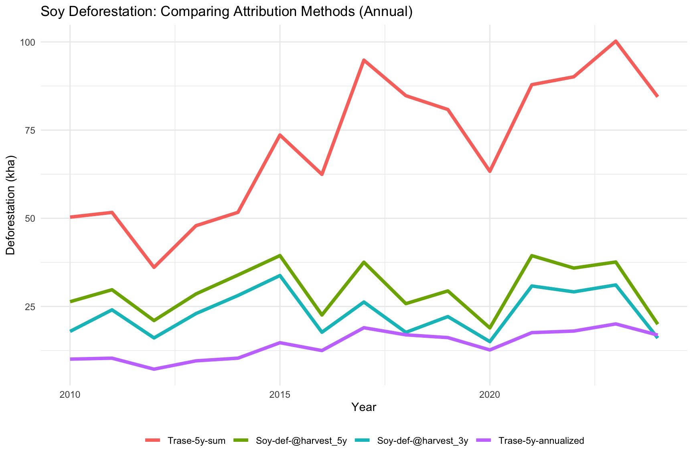
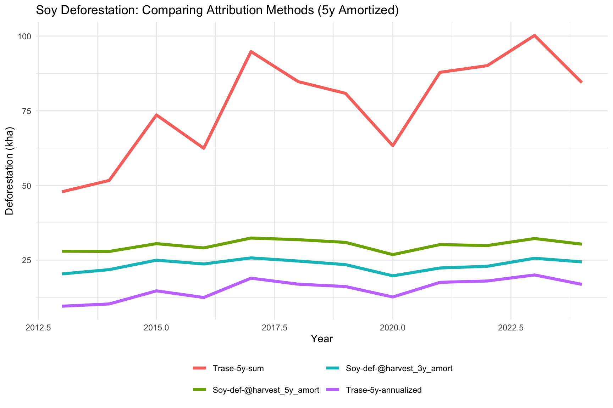
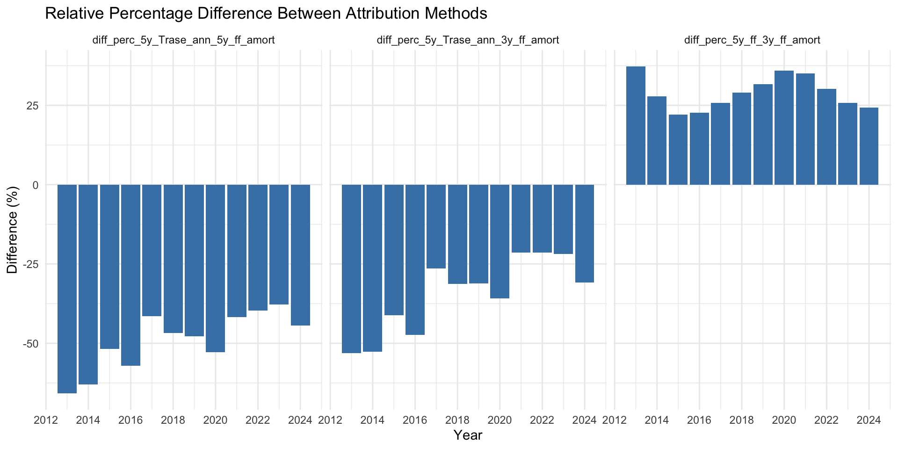
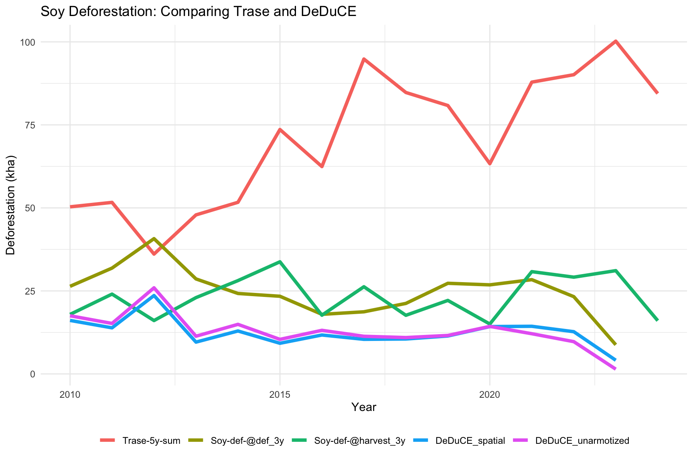
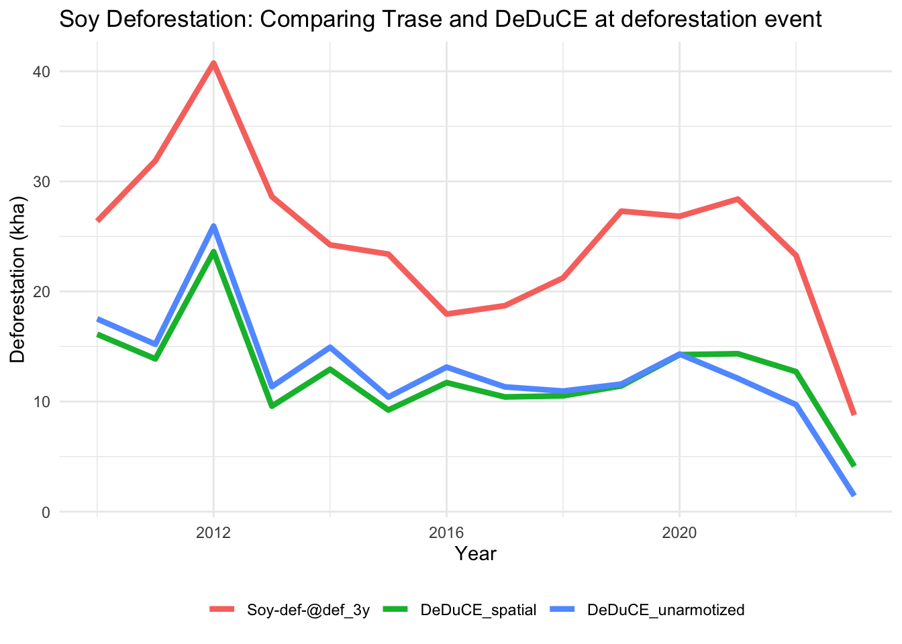
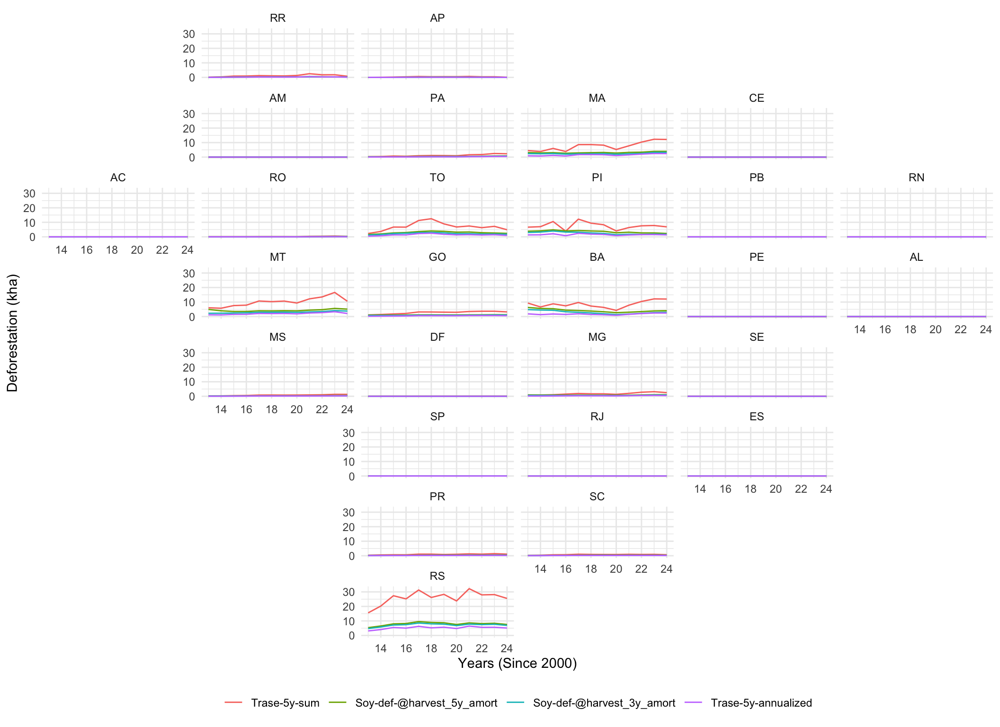
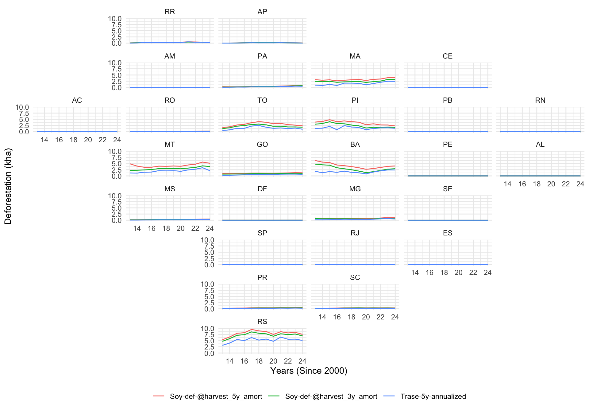
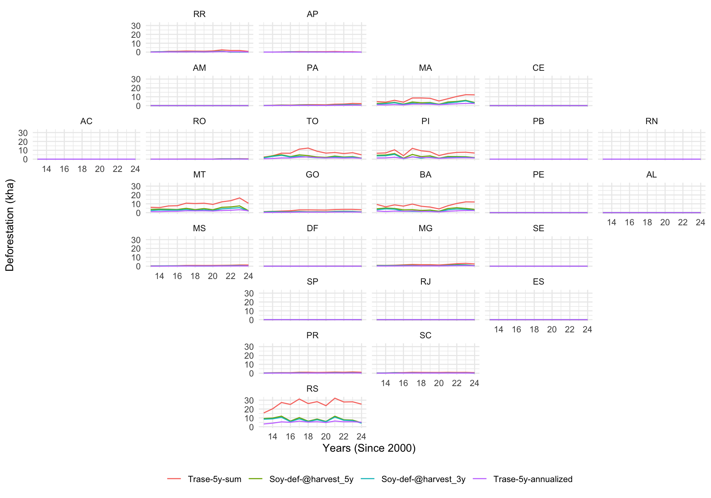
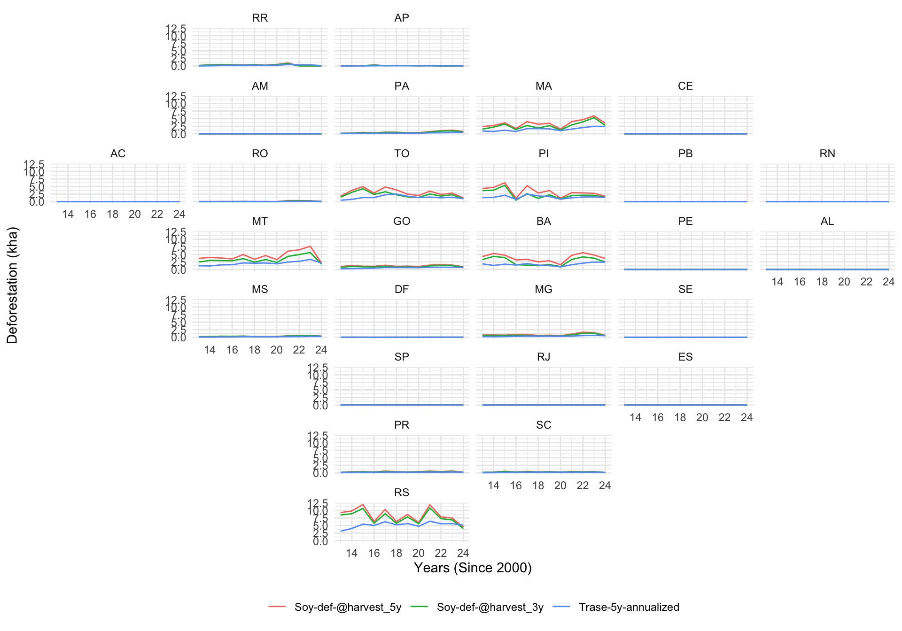

# Problem definition

Trase subnational data reports commodity deforestation as the summed deforestation over a specific time period that occurred on the land used for commodity production. This is different from DeDuCE, classifying assigning each deforestation event to a specific commodity. 

DeDuCE approach is partly considered superior, because it is true to the annually observed deforestation (no double counting), allowing single and multi year reporting of commodity deforestation (multi year is not supported by Trase CDO sums, because one deforestation event would be counted multiple times.)

DeDuCE reports deforestation at the deforestation event, which may be unsuitable for Trase CDO, aiming to report the deforestation embedded in the harvest. 
However, DeDuCE metrics can easily be shifted to the harvest year instead of deforestation year, enabling reporting embedded deforestation.

## Suggested solution detailed below
Add additional metric following DeDuCE deforestation classification approach and report commodity deforestation
- At deforestation event year (note, recent years will undercount deforestation)
- At harvest year (note, by moving to harvest year, we can report the most recent year)


# Exploring the new deforestation metrics
This document compares Trase commodity deforestation attribution methods, with DeDuCE forward looking approach, and compares results to original DeDuCE results. 

Aim is to suggest a more comparable metric for Trase to adopt in its context impacts reporting, comparable to DeDuCE and annual deforestation reporting. 

## Setup and data ingestion

In this section, we load the required libraries for spatial analysis, data manipulation, and visualization, and import our annual soy metrics datasets.


::: {.cell}

```{.r .cell-code}
library(tidyverse)
library(slider)
library(arrow)
library(geofacet)
library(scales)
library(sf)
library(zoo)

# Load datasets
soy_br <- read_parquet("~/documents/data/annual_metrics/soy_annual_br.parquet")
soy_states <- read_parquet(
  "~/documents/data/annual_metrics/soy_annual_br_states.parquet"
)
soy_supply_chain_2022_v2 <- read_parquet(
  "~/documents/data/annual_metrics/soy_2022_post_embedding_quants_v2.parquet"
)
```
:::


# Country-level analysis
I begin by evaluating how different methodological choices impact estimated soy-driven deforestation at the national level. Specifically, I compare:

- 5-year Sum: Cumulative backward-looking deforestation.
- 5-year Annualized: Backward-looking annualized deforestation.
- 5-year / 3-year Harvest Attribution: Forward-looking spatial attribution windows.

## Annual attribution comparison

::: {.cell}

```{.r .cell-code}
ggplot(
  soy_br |>
    filter(year >= 2010 & year <= 2024) |>
    filter(
      variable %in%
        c(
          "soy_def_5y_back",
          "soy_def_5y_annualized_back",
          "soy_def_harvest5y",
          "soy_def_harvest3y"
        )
    ) |>
    mutate(
      variable = case_when(
        variable == "soy_def_5y_back" ~ "Trase-5y-sum",
        variable == "soy_def_5y_annualized_back" ~ "Trase-5y-annualized",
        variable == "soy_def_harvest5y" ~ "Soy-def-@harvest_5y",
        variable == "soy_def_harvest3y" ~ "Soy-def-@harvest_3y",
        .default = variable
      )
    ),
  aes(year, ha / 10000, color = fct_reorder(variable, ha, .desc = TRUE))
) +
  geom_line(lwd = 1.5) +
  labs(
    title = "Soy Deforestation: Comparing Attribution Methods (Annual)",
    y = "Deforestation (kha)",
    x = "Year",
    color = NULL
  ) +
  theme_minimal() +
  theme(legend.position = "bottom")
```

::: {.cell-output-display}
{width=864}
:::
:::


## Key insights:

- 5-year Sum inherently double-counts annual deforestation over the evaluation window.
- 5-year Annualized undercounts actual annual deforestation. This occurs because the conversion from cleared land to soy commonly does not happen in the immediate first year after deforestation; dividing uniformly by 5 dilutes the calculated impact.
- 3-year vs. 5-year forward attribution windows yields highly similar trends, though the 5-year window remains expectedly higher.

## Amortized 5-year estimation
To smooth out annual volatility, I calculate a 5-year right-aligned rolling mean (amortization) for the forward-looking harvest attribution variables.


::: {.cell}

```{.r .cell-code}
soy_br_5ymean <- soy_br |>
  filter(variable %in% c("soy_def_harvest5y", "soy_def_harvest3y")) |>
  ungroup() |>
  group_by(variable) |>
  arrange(year, .by_group = TRUE) |>
  mutate(amortized_5 = rollmean(ha, k = 5, align = "right", fill = NA)) |>
  transmute(
    year = year,
    variable = paste0(variable, "_5y_amort"),
    ha = amortized_5
  )

soy_br_amort <- soy_br |> bind_rows(soy_br_5ymean)
```
:::


::: {.cell}

```{.r .cell-code}
ggplot(
  soy_br_amort |>
    filter(year >= 2013 & year <= 2024) |>
    filter(
      variable %in%
        c(
          "soy_def_5y_back",
          "soy_def_5y_annualized_back",
          "soy_def_harvest5y_5y_amort",
          "soy_def_harvest3y_5y_amort"
        )
    ) |>
    mutate(
      variable = case_when(
        variable == "soy_def_5y_back" ~ "Trase-5y-sum",
        variable == "soy_def_5y_annualized_back" ~ "Trase-5y-annualized",
        variable == "soy_def_harvest5y_5y_amort" ~ "Soy-def-@harvest_5y_amort",
        variable == "soy_def_harvest3y_5y_amort" ~ "Soy-def-@harvest_3y_amort",
        .default = variable
      )
    ),
  aes(year, ha / 10000, color = fct_reorder(variable, ha, .desc = TRUE))
) +
  geom_line(lwd = 1.5) +
  labs(
    title = "Soy Deforestation: Comparing Attribution Methods (5y Amortized)",
    y = "Deforestation (kha)",
    x = "Year",
    color = NULL
  ) +
  theme_minimal() +
  theme(legend.position = "bottom") +
  guides(color = guide_legend(nrow = 2))
```

::: {.cell-output-display}
{width=864}
:::
:::


## Key insights:

- amortization smoothes the reported deforestation estimates. Decision if annual or amortized metrics are better to show needed.
- from data perspective, amortization might provide more consistent and robust reporting
  - does not pick up changing trends as quick, but also more robust to data issues
  - from a user understanding a more simple annual metric.


relevant context information:
- Deduce dashboard reports annual deforestation
- Trase factsheets use 5 year amortized DeDuCE deforestation

## Percentage differences Between Methods
To quantify the divergence between backward-looking and forward-looking metrics, I also look at the relative percentage differences.

::: {.cell}

```{.r .cell-code}
soy_br_amort_wide <- soy_br_amort |>
  pivot_wider(id_cols = year, names_from = variable, values_from = ha)

soy_br_amort_perc <- soy_br_amort_wide |>
  filter(year >= 2013) |>
  transmute(
    year = year,
    diff_perc_5y_Trase_ann_5y_ff_amort = ((soy_def_5y_annualized_back -
      soy_def_harvest5y_5y_amort) /
      soy_def_harvest5y_5y_amort) *
      100,
    diff_perc_5y_Trase_ann_3y_ff_amort = ((soy_def_5y_annualized_back -
      soy_def_harvest3y_5y_amort) /
      soy_def_harvest3y_5y_amort) *
      100,
    diff_perc_5y_ff_3y_ff_amort = ((soy_def_harvest5y_5y_amort -
      soy_def_harvest3y_5y_amort) /
      soy_def_harvest3y_5y_amort) *
      100
  )

soy_br_amort_perc_l <- soy_br_amort_perc |>
  pivot_longer(cols = -year, names_to = "variable", values_to = "percent")

ggplot(soy_br_amort_perc_l, aes(year, percent)) +
  geom_bar(stat = "identity", fill = "steelblue") +
  facet_wrap(~ fct_reorder(variable, percent)) +
  labs(
    title = "Relative Percentage Difference Between Attribution Methods",
    x = "Year",
    y = "Difference (%)"
  ) +
  scale_x_continuous(breaks = breaks_pretty()) +
  theme_minimal()
```

::: {.cell-output-display}
{width=960}
:::
:::


## Key insights:

- Annualization of the Trase 5-year sum would miss between 20% and 80% of soy deforestation annually, depending heavily on the reference year and whether a 3- or 5-year attribution window is chosen.
- A 5-year forward-looking window maps roughly 22% to 30% more soy deforestation than a 3-year forward-looking window.

# Forward looking attribution vs deduce
As the intention is to align methods between Trase subnational context and DeDuCE, it is important to understand the difference between attribution to deforestation vs harvest year


::: {.cell}

```{.r .cell-code}
ggplot(
  soy_br |>
    filter(year >= 2010 & year <= 2024) |>
    filter(
      variable %in%
        c(
          "soy_def_5y_back",
          #"soy_def_harvest5y",
          "soy_def_harvest3y",
          "soy_def_def3y",
          "deduce_unarmotized",
          "soy_def_def3y_gfc"
        )
    ) |>
    mutate(
      variable = case_when(
        variable == "soy_def_5y_back" ~ "Trase-5y-sum",
        #variable == "soy_def_harvest5y" ~ "Soy-def-@harvest_5y",
        variable == "soy_def_harvest3y" ~ "Soy-def-@harvest_3y",
        variable == "soy_def_def3y" ~ "Soy-def-@def_3y",
        variable == "deduce_unarmotized" ~ "DeDuCE_unarmotized",
        variable == "soy_def_def3y_gfc" ~ "DeDuCE_spatial",
        .default = variable
      )
    ),
  aes(year, ha / 10000, color = fct_reorder(variable, ha, .desc = TRUE))
) +
  geom_line(lwd = 1.5) +
  labs(
    title = "Soy Deforestation: Comparing Trase and DeDuCE",
    y = "Deforestation (kha)",
    x = "Year",
    color = NULL
  ) +
  theme_minimal() +
  theme(legend.position = "bottom")
```

::: {.cell-output-display}
{width=864}
:::
:::


::: {.cell}

```{.r .cell-code}
ggplot(
  soy_br |>
    filter(year >= 2010 & year <= 2024) |>
    filter(
      variable %in%
        c(
          #"soy_def_5y_back",
          #"soy_def_harvest5y",
          #"soy_def_harvest3y",
          "soy_def_def3y",
          "deduce_unarmotized",
          "soy_def_def3y_gfc"
        )
    ) |>
    mutate(
      variable = case_when(
        # variable == "soy_def_5y_back" ~ "Trase-5y-sum",
        #variable == "soy_def_harvest5y" ~ "Soy-def-@harvest_5y",
        #variable == "soy_def_harvest3y" ~ "Soy-def-@harvest_3y",
        variable == "soy_def_def3y" ~ "Soy-def-@def_3y",
        variable == "deduce_unarmotized" ~ "DeDuCE_unarmotized",
        variable == "soy_def_def3y_gfc" ~ "DeDuCE_spatial",
        .default = variable
      )
    ),
  aes(year, ha / 10000, color = fct_reorder(variable, ha, .desc = TRUE))
) +
  geom_line(lwd = 1.5) +
  labs(
    title = "Soy Deforestation: Comparing Trase and DeDuCE at deforestation event",
    y = "Deforestation (kha)",
    x = "Year",
    color = NULL
  ) +
  theme_minimal() +
  theme(legend.position = "bottom")
```

::: {.cell-output-display}
{width=672}
:::
:::


## key difference
- difference of trends due to different attribution year DeDuCE attributes to deforestation, while Trase commonly aims to attribute to harvest. 
- overall difference in total amount are due to differences in forest definition and data deforestation data used


# State-Level Analysis
I now scale the calculations down to individual Brazilian states to determine if sub-national trends and patterns align with national averages.

::: {.cell}

```{.r .cell-code}
soy_states_5ymean <- soy_states |>
  filter(variable %in% c("soy_def_harvest5y", "soy_def_harvest3y")) |>
  ungroup() |>
  group_by(variable, code, name, abbreviation) |>
  arrange(year, .by_group = TRUE) |>
  mutate(amortized_5 = rollmean(ha, k = 5, align = "right", fill = NA)) |>
  transmute(
    year = year,
    code = code,
    name = name,
    abbreviation = abbreviation,
    variable = paste0(variable, "_5y_amort"),
    ha = amortized_5
  )

soy_states_amort <- soy_states |> bind_rows(soy_states_5ymean)
```
:::


## State-level: Amortized

::: {.cell}

```{.r .cell-code}
ggplot(
  soy_states_amort |>
    filter(year >= 2013) |>
    filter(
      variable %in%
        c(
          "soy_def_5y_back",
          "soy_def_5y_annualized_back",
          "soy_def_harvest5y_5y_amort",
          "soy_def_harvest3y_5y_amort"
        )
    ) |>
    mutate(
      variable = case_when(
        variable == "soy_def_5y_back" ~ "Trase-5y-sum",
        variable == "soy_def_5y_annualized_back" ~ "Trase-5y-annualized",
        variable == "soy_def_harvest5y_5y_amort" ~ "Soy-def-@harvest_5y_amort",
        variable == "soy_def_harvest3y_5y_amort" ~ "Soy-def-@harvest_3y_amort",
        .default = variable
      )
    ),
  aes(year - 2000, ha / 10000, color = fct_reorder(variable, ha, .desc = TRUE))
) +
  geom_line() +
  scale_x_continuous(breaks = breaks_pretty()) +
  labs(x = "Years (Since 2000)", y = "Deforestation (kha)", color = NULL) +
  facet_geo(~abbreviation, grid = "br_states_grid1") +
  theme_minimal() +
  theme(legend.position = "bottom")
```

::: {.cell-output-display}
{width=1056}
:::
:::

## State-level: amortized vs non-amortized

::: {.cell}

```{.r .cell-code}
ggplot(
  soy_states_amort |>
    filter(year >= 2013) |>
    filter(
      variable %in%
        c(
          "soy_def_5y_annualized_back",
          "soy_def_harvest5y_5y_amort",
          "soy_def_harvest3y_5y_amort"
        )
    ) |>
    mutate(
      variable = case_when(
        variable == "soy_def_5y_annualized_back" ~ "Trase-5y-annualized",
        variable == "soy_def_harvest5y_5y_amort" ~ "Soy-def-@harvest_5y_amort",
        variable == "soy_def_harvest3y_5y_amort" ~ "Soy-def-@harvest_3y_amort",
        .default = variable
      )
    ),
  aes(year - 2000, ha / 10000, color = fct_reorder(variable, ha, .desc = TRUE))
) +
  geom_line() +
  scale_x_continuous(breaks = breaks_pretty()) +
  labs(x = "Years (Since 2000)", y = "Deforestation (kha)", color = NULL) +
  facet_geo(~abbreviation, grid = "br_states_grid1") +
  theme_minimal() +
  theme(legend.position = "bottom")
```

::: {.cell-output-display}
{width=960}
:::
:::


## Non-Amortized (All Metrics)

::: {.cell}

```{.r .cell-code}
ggplot(
  soy_states_amort |>
    filter(year >= 2013) |>
    filter(
      variable %in%
        c(
          "soy_def_5y_back",
          "soy_def_5y_annualized_back",
          "soy_def_harvest5y",
          "soy_def_harvest3y"
        )
    ) |>
    mutate(
      variable = case_when(
        variable == "soy_def_5y_back" ~ "Trase-5y-sum",
        variable == "soy_def_5y_annualized_back" ~ "Trase-5y-annualized",
        variable == "soy_def_harvest5y" ~ "Soy-def-@harvest_5y",
        variable == "soy_def_harvest3y" ~ "Soy-def-@harvest_3y",
        .default = variable
      )
    ),
  aes(year - 2000, ha / 10000, color = fct_reorder(variable, ha, .desc = TRUE))
) +
  geom_line() +
  scale_x_continuous(breaks = breaks_pretty()) +
  labs(x = "Years (Since 2000)", y = "Deforestation (kha)", color = NULL) +
  facet_geo(~abbreviation, grid = "br_states_grid1") +
  theme_minimal() +
  theme(legend.position = "bottom")
```

::: {.cell-output-display}
{width=960}
:::
:::


## Non-Amortized (Excl. 5y-Sum)

::: {.cell}

```{.r .cell-code}
ggplot(
  soy_states_amort |>
    filter(year >= 2013) |>
    filter(
      variable %in%
        c(
          "soy_def_5y_annualized_back",
          "soy_def_harvest5y",
          "soy_def_harvest3y"
        )
    ) |>
    mutate(
      variable = case_when(
        variable == "soy_def_5y_annualized_back" ~ "Trase-5y-annualized",
        variable == "soy_def_harvest5y" ~ "Soy-def-@harvest_5y",
        variable == "soy_def_harvest3y" ~ "Soy-def-@harvest_3y",
        .default = variable
      )
    ),
  aes(year - 2000, ha / 10000, color = fct_reorder(variable, ha, .desc = TRUE))
) +
  geom_line() +
  scale_x_continuous(breaks = breaks_pretty()) +
  labs(x = "Years (Since 2000)", y = "Deforestation (kha)", color = NULL) +
  facet_geo(~abbreviation, grid = "br_states_grid1") +
  theme_minimal() +
  theme(legend.position = "bottom")
```

::: {.cell-output-display}
{width=960}
:::
:::


# key insight:
- trends and patterns are consistent across attribution methods


# Supply Chain & Trader Exposure (2022)
In this final section, we look at supply chain allocations for the year 2022 to isolate the top 10 exporters, production regions, and importing country groups exposing themselves to deforestation risks under alternative accounting frameworks.

::: {.cell}

```{.r .cell-code}
# Exporter Aggregation
soy_supply_chain_2022_v2_exp <- soy_supply_chain_2022_v2 |>
  group_by(EXPORTER_GROUP) |>
  summarize(across(ends_with("_exp"), ~ sum(.x, na.rm = TRUE)))

# Production Region Aggregation
soy_supply_chain_2022_v2_reg <- soy_supply_chain_2022_v2 |>
  group_by(LVL6_NAME_PROD) |>
  summarize(across(ends_with("_exp"), ~ sum(.x, na.rm = TRUE)))

# Importer Country Aggregation
soy_supply_chain_2022_v2_imp <- soy_supply_chain_2022_v2 |>
  group_by(COUNTRY_GROUP) |>
  summarize(across(ends_with("_exp"), ~ sum(.x, na.rm = TRUE)))
```
:::

## Top 10 Trader Exposure Lists
Below we compare how different metrics rearrange or weigh the risk profiles of top exporters.

::: {.cell}

```{.r .cell-code}
cat("Trase 5-Year Sum Deforestation\n")
```

::: {.cell-output .cell-output-stdout}

```
Trase 5-Year Sum Deforestation
```


:::

```{.r .cell-code}
soy_supply_chain_2022_v2_exp |>
  arrange(desc(soy_def_5y_back_exp)) |>
  select(EXPORTER_GROUP, soy_def_5y_back_exp) |>
  filter(!EXPORTER_GROUP %in% c("PROCESSED DOMESTICALLY", "UNKNOWN")) |>
  top_n(10)
```

::: {.cell-output .cell-output-stdout}

```
# A tibble: 10 × 2
   EXPORTER_GROUP                                            soy_def_5y_back_exp
   <chr>                                                                   <dbl>
 1 BUNGE                                                                  91613.
 2 COFCO                                                                  67956.
 3 CARGILL                                                                66258.
 4 NOVAAGRI INFRA-ESTRUTURA DE ARMAZENAGEM E ESCOAMENTO AGR…              45916.
 5 ADM                                                                    44987.
 6 LOUIS DREYFUS                                                          38958.
 7 GAVILON                                                                38260.
 8 AMAGGI & LD COMMODITIES                                                28827.
 9 OLAM                                                                   24049.
10 AMAGGI                                                                 22243.
```


:::

```{.r .cell-code}
cat("Trase Forward-Looking 5-Year Amortized\n")
```

::: {.cell-output .cell-output-stdout}

```
Trase Forward-Looking 5-Year Amortized
```


:::

```{.r .cell-code}
soy_supply_chain_2022_v2_exp |>
  arrange(desc(soy_def_harvest5y_5y_amort_exp)) |>
  select(EXPORTER_GROUP, soy_def_harvest5y_5y_amort_exp) |>
  filter(!EXPORTER_GROUP %in% c("PROCESSED DOMESTICALLY", "UNKNOWN")) |>
  top_n(10)
```

::: {.cell-output .cell-output-stdout}

```
# A tibble: 10 × 2
   EXPORTER_GROUP                                         soy_def_harvest5y_5y…¹
   <chr>                                                                   <dbl>
 1 BUNGE                                                                  29772.
 2 CARGILL                                                                22919.
 3 COFCO                                                                  20331.
 4 ADM                                                                    15661.
 5 NOVAAGRI INFRA-ESTRUTURA DE ARMAZENAGEM E ESCOAMENTO …                 14631.
 6 LOUIS DREYFUS                                                          13106.
 7 GAVILON                                                                11847.
 8 AMAGGI & LD COMMODITIES                                                10337.
 9 AMAGGI                                                                  8165.
10 OLAM                                                                    7073.
# ℹ abbreviated name: ¹​soy_def_harvest5y_5y_amort_exp
```


:::

```{.r .cell-code}
cat("Trase Forward-Looking 3-Year Amortized\n")
```

::: {.cell-output .cell-output-stdout}

```
Trase Forward-Looking 3-Year Amortized
```


:::

```{.r .cell-code}
soy_supply_chain_2022_v2_exp |>
  arrange(desc(soy_def_harvest3y_5y_amort_exp)) |>
  select(EXPORTER_GROUP, soy_def_harvest3y_5y_amort_exp) |>
  filter(!EXPORTER_GROUP %in% c("PROCESSED DOMESTICALLY", "UNKNOWN")) |>
  top_n(10)
```

::: {.cell-output .cell-output-stdout}

```
# A tibble: 10 × 2
   EXPORTER_GROUP                                         soy_def_harvest3y_5y…¹
   <chr>                                                                   <dbl>
 1 BUNGE                                                                  22983.
 2 COFCO                                                                  17385.
 3 CARGILL                                                                16689.
 4 ADM                                                                    11122.
 5 NOVAAGRI INFRA-ESTRUTURA DE ARMAZENAGEM E ESCOAMENTO …                 11066.
 6 LOUIS DREYFUS                                                           9900.
 7 GAVILON                                                                 9344.
 8 AMAGGI & LD COMMODITIES                                                 7173.
 9 OLAM                                                                    5917.
10 AMAGGI                                                                  5814.
# ℹ abbreviated name: ¹​soy_def_harvest3y_5y_amort_exp
```


:::

```{.r .cell-code}
cat("Trase Forward-Looking 3-Year\n")
```

::: {.cell-output .cell-output-stdout}

```
Trase Forward-Looking 3-Year
```


:::

```{.r .cell-code}
soy_supply_chain_2022_v2_exp |>
  arrange(desc(soy_def_harvest3y_exp)) |>
  select(EXPORTER_GROUP, soy_def_harvest3y_exp) |>
  filter(!EXPORTER_GROUP %in% c("PROCESSED DOMESTICALLY", "UNKNOWN")) |>
  top_n(10)
```

::: {.cell-output .cell-output-stdout}

```
# A tibble: 10 × 2
   EXPORTER_GROUP                                          soy_def_harvest3y_exp
   <chr>                                                                   <dbl>
 1 BUNGE                                                                  30796.
 2 CARGILL                                                                23843.
 3 COFCO                                                                  17768.
 4 NOVAAGRI INFRA-ESTRUTURA DE ARMAZENAGEM E ESCOAMENTO A…                16837.
 5 ADM                                                                    15955.
 6 GAVILON                                                                13320.
 7 LOUIS DREYFUS                                                          13069.
 8 AMAGGI & LD COMMODITIES                                                10547.
 9 OLAM                                                                    8233.
10 AMAGGI                                                                  8024.
```


:::
:::


### key insights:
- same 5 Traders with highest number of deforestation
- order chchanges for 2 companies only

Top 10 Regional Exposure Lists (Production Level 6)

::: {.cell}

```{.r .cell-code}
cat("Trase 5-Year Sum Deforestation\n")
```

::: {.cell-output .cell-output-stdout}

```
Trase 5-Year Sum Deforestation
```


:::

```{.r .cell-code}
soy_supply_chain_2022_v2_reg |>
  arrange(desc(soy_def_5y_back_exp)) |>
  select(LVL6_NAME_PROD, soy_def_5y_back_exp) |>
  filter(LVL6_NAME_PROD != "UNKNOWN") |>
  top_n(10)
```

::: {.cell-output .cell-output-stdout}

```
# A tibble: 10 × 2
   LVL6_NAME_PROD         soy_def_5y_back_exp
   <chr>                                <dbl>
 1 SAO GABRIEL                         16972.
 2 SANTANA DO LIVRAMENTO               15888.
 3 DOM PEDRITO                         15799.
 4 BALSAS                              15300.
 5 ALEGRETE                            13543.
 6 FELIZ NATAL                         11667.
 7 LUIS EDUARDO MAGALHAES              10919.
 8 SAO DESIDERIO                       10009.
 9 FORMOSA DO RIO PRETO                 8876.
10 URUCUI                               8816.
```


:::

```{.r .cell-code}
cat("Trase Forward-Looking 5-Year Amortized\n")
```

::: {.cell-output .cell-output-stdout}

```
Trase Forward-Looking 5-Year Amortized
```


:::

```{.r .cell-code}
soy_supply_chain_2022_v2_reg |>
  arrange(desc(soy_def_harvest5y_5y_amort_exp)) |>
  select(LVL6_NAME_PROD, soy_def_harvest5y_5y_amort_exp) |>
  filter(LVL6_NAME_PROD != "UNKNOWN") |>
  top_n(10)
```

::: {.cell-output .cell-output-stdout}

```
# A tibble: 10 × 2
   LVL6_NAME_PROD         soy_def_harvest5y_5y_amort_exp
   <chr>                                           <dbl>
 1 BALSAS                                          5640.
 2 SAO GABRIEL                                     4816.
 3 FELIZ NATAL                                     4162.
 4 SAO DESIDERIO                                   3992.
 5 DOM PEDRITO                                     3923.
 6 SANTANA DO LIVRAMENTO                           3789.
 7 ALEGRETE                                        3516.
 8 URUCUI                                          3163.
 9 BARREIRAS                                       3048.
10 LUIS EDUARDO MAGALHAES                          3013.
```


:::

```{.r .cell-code}
cat("Trase Forward-Looking 3-Year Amortized\n")
```

::: {.cell-output .cell-output-stdout}

```
Trase Forward-Looking 3-Year Amortized
```


:::

```{.r .cell-code}
soy_supply_chain_2022_v2_reg |>
  arrange(desc(soy_def_harvest3y_5y_amort_exp)) |>
  select(LVL6_NAME_PROD, soy_def_harvest3y_5y_amort_exp) |>
  filter(LVL6_NAME_PROD != "UNKNOWN") |>
  top_n(10)
```

::: {.cell-output .cell-output-stdout}

```
# A tibble: 10 × 2
   LVL6_NAME_PROD         soy_def_harvest3y_5y_amort_exp
   <chr>                                           <dbl>
 1 SAO GABRIEL                                     4609.
 2 BALSAS                                          3881.
 3 DOM PEDRITO                                     3743.
 4 SANTANA DO LIVRAMENTO                           3642.
 5 ALEGRETE                                        3214.
 6 FELIZ NATAL                                     2981.
 7 BARREIRAS                                       2198.
 8 LUIS EDUARDO MAGALHAES                          2124.
 9 ROSARIO DO SUL                                  2046.
10 CACEQUI                                         1940.
```


:::

```{.r .cell-code}
cat("Trase Forward-Looking 3-Year\n")
```

::: {.cell-output .cell-output-stdout}

```
Trase Forward-Looking 3-Year
```


:::

```{.r .cell-code}
soy_supply_chain_2022_v2_reg |>
  arrange(desc(soy_def_harvest3y_exp)) |>
  select(LVL6_NAME_PROD, soy_def_harvest3y_exp) |>
  filter(LVL6_NAME_PROD != "UNKNOWN") |>
  top_n(10)
```

::: {.cell-output .cell-output-stdout}

```
# A tibble: 10 × 2
   LVL6_NAME_PROD         soy_def_harvest3y_exp
   <chr>                                  <dbl>
 1 SANTANA DO LIVRAMENTO                  5896.
 2 BALSAS                                 5160.
 3 FELIZ NATAL                            4293.
 4 TASSO FRAGOSO                          4230.
 5 ALEGRETE                               4188.
 6 LUIS EDUARDO MAGALHAES                 3915.
 7 FORMOSA DO RIO PRETO                   3818.
 8 SAO DESIDERIO                          3443.
 9 DOM PEDRITO                            3435.
10 SAO GABRIEL                            3102.
```


:::
:::


### key insights:
- same 5 Traders with highest number of deforestation
- order chchanges for 2 companies only


## Top 10 Importer Exposure Lists (Country Groups)


::: {.cell}

```{.r .cell-code}
cat("Trase 5-Year Sum Deforestation\n")
```

::: {.cell-output .cell-output-stdout}

```
Trase 5-Year Sum Deforestation
```


:::

```{.r .cell-code}
soy_supply_chain_2022_v2_imp |>
  arrange(desc(soy_def_5y_back_exp)) |>
  select(COUNTRY_GROUP, soy_def_5y_back_exp) |>
  filter(!COUNTRY_GROUP %in% c("BRAZIL", "UNKNOWN COUNTRY EUROPEAN UNION")) |>
  top_n(10)
```

::: {.cell-output .cell-output-stdout}

```
# A tibble: 10 × 2
   COUNTRY_GROUP    soy_def_5y_back_exp
   <chr>                          <dbl>
 1 CHINA (MAINLAND)             252211.
 2 SINGAPORE                     78994.
 3 SPAIN                         29256.
 4 THAILAND                      25690.
 5 INDONESIA                     23670.
 6 SOUTH AFRICA                  21786.
 7 IRAN                          19525.
 8 INDIA                         19352.
 9 VIETNAM                       17850.
10 FRANCE                        15706.
```


:::

```{.r .cell-code}
cat("Trase Forward-Looking 5-Year Amortized\n")
```

::: {.cell-output .cell-output-stdout}

```
Trase Forward-Looking 5-Year Amortized
```


:::

```{.r .cell-code}
soy_supply_chain_2022_v2_imp |>
  arrange(desc(soy_def_harvest5y_5y_amort_exp)) |>
  select(COUNTRY_GROUP, soy_def_harvest5y_5y_amort_exp) |>
  filter(!COUNTRY_GROUP %in% c("BRAZIL", "UNKNOWN COUNTRY EUROPEAN UNION")) |>
  top_n(10)
```

::: {.cell-output .cell-output-stdout}

```
# A tibble: 10 × 2
   COUNTRY_GROUP    soy_def_harvest5y_5y_amort_exp
   <chr>                                     <dbl>
 1 CHINA (MAINLAND)                         82951.
 2 SINGAPORE                                26916.
 3 THAILAND                                  9246.
 4 SPAIN                                     9235.
 5 SOUTH AFRICA                              7423.
 6 INDONESIA                                 7420.
 7 IRAN                                      6116.
 8 INDIA                                     5886.
 9 VIETNAM                                   5594.
10 TURKEY                                    5370.
```


:::

```{.r .cell-code}
cat("Trase Forward-Looking 3-Year Amortized\n")
```

::: {.cell-output .cell-output-stdout}

```
Trase Forward-Looking 3-Year Amortized
```


:::

```{.r .cell-code}
soy_supply_chain_2022_v2_imp |>
  arrange(desc(soy_def_harvest3y_5y_amort_exp)) |>
  select(COUNTRY_GROUP, soy_def_harvest3y_5y_amort_exp) |>
  filter(!COUNTRY_GROUP %in% c("BRAZIL", "UNKNOWN COUNTRY EUROPEAN UNION")) |>
  top_n(10)
```

::: {.cell-output .cell-output-stdout}

```
# A tibble: 10 × 2
   COUNTRY_GROUP    soy_def_harvest3y_5y_amort_exp
   <chr>                                     <dbl>
 1 CHINA (MAINLAND)                         63788.
 2 SINGAPORE                                19324.
 3 SPAIN                                     7390.
 4 THAILAND                                  6595.
 5 INDONESIA                                 6083.
 6 SOUTH AFRICA                              5330.
 7 IRAN                                      5118.
 8 INDIA                                     5029.
 9 VIETNAM                                   4649.
10 FRANCE                                    3859.
```


:::

```{.r .cell-code}
cat("Trase Forward-Looking 3-Year\n")
```

::: {.cell-output .cell-output-stdout}

```
Trase Forward-Looking 3-Year
```


:::

```{.r .cell-code}
soy_supply_chain_2022_v2_imp |>
  arrange(desc(soy_def_harvest3y_exp)) |>
  select(COUNTRY_GROUP, soy_def_harvest3y_exp) |>
  filter(!COUNTRY_GROUP %in% c("BRAZIL", "UNKNOWN COUNTRY EUROPEAN UNION")) |>
  top_n(10)
```

::: {.cell-output .cell-output-stdout}

```
# A tibble: 10 × 2
   COUNTRY_GROUP    soy_def_harvest3y_exp
   <chr>                            <dbl>
 1 CHINA (MAINLAND)                82090.
 2 SINGAPORE                       29202.
 3 THAILAND                         8923.
 4 SPAIN                            8887.
 5 SOUTH AFRICA                     8053.
 6 INDONESIA                        7385.
 7 IRAN                             5730.
 8 INDIA                            5221.
 9 VIETNAM                          5159.
10 TURKEY                           5147.
```


:::
:::


### Key insights:
- small changes in deforestation exposure change rankings slightly - but not dramatically.